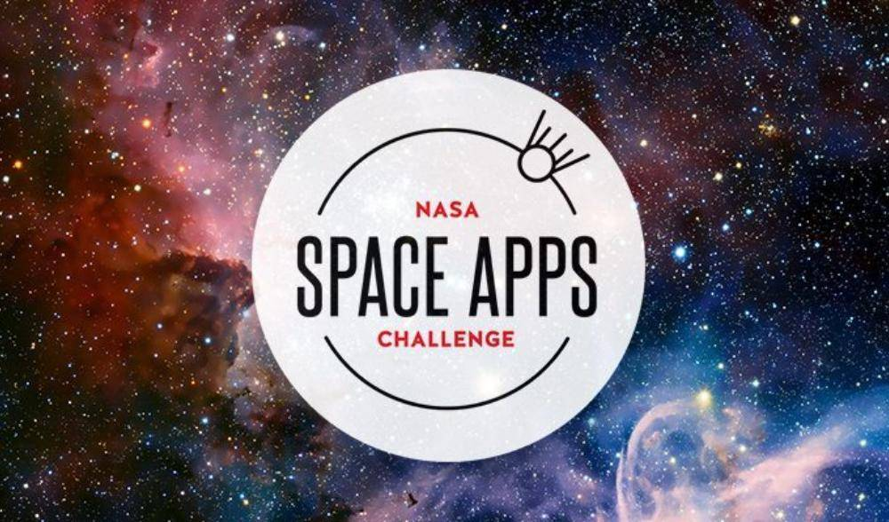

<a href="https://docs.google.com/presentation/d/1RDKh3gcbKKT41pvXCjPvbelKAohsEIeB/edit?usp=sharing&ouid=106931575924110208198&rtpof=true&sd=true">https://docs.google.com/presentation/d/1RDKh3gcbKKT41pvXCjPvbelKAohsEIeB/edit?usp=sharing&ouid=106931575924110208198&rtpof=true&sd=true</a>

This is a talk in "NASA Space Apps 2019" where I showed the attendants about Firebase and the use of streams to create an Instagram like app but with planets.